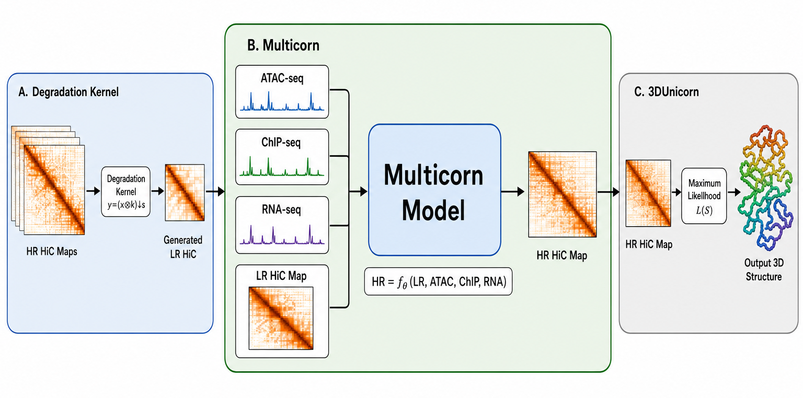

# Multicorn: Multimodal Enhancement of Single-Cell Hi-C Data for Robust 3D Genome Structure Reconstruction

**Multicorn** (**Multi**modal Uni**corn**) is a multimodal blind super-resolution framework that grounds single-cell Hi-C (scHi-C) enhancement in the regulatory state of the genome. It is an improvement over **Unicorn**, integrating ATAC-seq, ChIP-seq H3K27ac, and RNA-seq as biological priors so that enhancement becomes a biology-guided inverse problem rather than pixel-level image restoration.

---

## Overview

The 3D organization of chromatin governs gene regulation, cellular identity, and disease, but reconstructing this architecture from scHi-C data is severely limited by extreme sparsity and stochastic noise. Existing enhancement methods, including recent blind super-resolution frameworks, operate on contact maps in isolation and therefore restore them as patterns of pixels, without regard for the underlying regulatory state of the genome. As a result, mathematically plausible contacts can still be biologically implausible.

Multicorn addresses this gap by integrating three orthogonal functional-genomics modalities:

- **ATAC-seq** — chromatin accessibility
- **ChIP-seq H3K27ac** — active enhancers
- **RNA-seq** — transcriptional output

A multimodal fusion layer encodes each 1D omics signal into a latent representation that conditions a deep alternating optimization loop, and a biologically constrained loss penalizes contacts that contradict the local regulatory landscape. Downstream 3D reconstructions generated from Multicorn-enhanced contact maps show improved agreement with orthogonal 3D-FISH measurements.

> Full implementation, runnable scripts, and detailed documentation live in [`Multicorn/`](Multicorn/).

---


## Architecture



Multicorn extends the ScUnicorn blind super-resolution backbone with three additions over the unimodal baseline: independent encoders for the regulatory tracks, a fusion injection that conditions restoration on the regulatory context, and a biologically constrained objective. The Deep Alternating Network (DAN) backbone is shared.

The pipeline has four stages:

1. **Inputs and encoders.** The scHi-C contact map is encoded by a 2D CNN into a feature map `F_HiC`. The three regulatory tracks are each encoded by an independent two-layer MLP (hidden widths `128, 64`) into 64-dimensional latents. Modality-specific encoders are a deliberate inductive bias because contact frequencies, read counts, and FPKM values have very different dynamic ranges and noise structures.
2. **Multimodal fusion.** The three latents are concatenated into the regulatory context `z_multi = [z_a ‖ z_c ‖ z_r] ∈ R^192`. A learned projection `φ` broadcasts it onto the Hi-C features: `F_cond = F_HiC + φ(z_multi)`. Concatenation over averaging preserves modality identity.
3. **Alternating restoration loop (N = 5).** An **Estimator** refines the degradation kernel `T` and a biologically constrained **Restorer** reconstructs the HR map under the regulatory prior. `z_multi` is reinjected at every iteration.
4. **Output.** A degradation tail checks low-resolution consistency and an image tail emits the enhanced HR map `H*`, which feeds 3DUnicorn for 3D reconstruction.

### Biologically constrained objective

Multicorn augments the base blind super-resolution objective with an explicit biological consistency term:

```
J_Multi(H, T, O) = ||L − T(H)||²  +  β · P(H)  +  γ · B(H, O)
```

- `||L − T(H)||²` — degradation-consistency data term (trained in `L1` form).
- `P(H)` — sparsity/smoothness prior on the reconstructed map.
- `B(H, O)` — biological consistency term over the normalized omics tracks `O = (a, c, r)`.

The constraint penalizes intensity placed between bins that are simultaneously inaccessible, unmarked, and silent:

```
s(i, O)        = mean( z(a_i), z(c_i), z(r_i) )
conflict(i, j) = [ s(i) < τ ]  and  [ s(j) < τ ]
B(H, O)        = Σ_ij  w_ij · H_ij · conflict(i, j)
w_ij           = 1 / (1 + |i − j| / d0)
```

`τ` is the lower 25th percentile of `s` across the chromosome and the genomic-distance weight `w_ij` (with `d0 = 10` bins) prevents long-range, low-intensity contacts from dominating. `B` is a **soft** prior: the data term can still drive `H_ij > 0` in heterochromatin when the data demands it, but at a `γ · w_ij · H_ij` cost. We use `γ = 0.1`.

---

## Installation

```bash
cd Multicorn
pip install -r requirements.txt
```

---

## Usage

### 1. Generate an enhanced HR contact map

```bash
cd Multicorn/scripts

python generate_multimodal_hr.py \
  --data_path ../../ScUnicorn/data/mouse_test_data/chr11_500kb.txt \
  --atac_data_path ../../ScUnicorn/data/mouse_test_data/GSE160472_ATAC_Seq.txt \
  --chip_data_path ../../ScUnicorn/data/mouse_test_data/GSE269897_CHIP_Seq.txt \
  --rna_data_path ../../ScUnicorn/data/mouse_test_data/GSE287905_RNA_Seq.txt \
  --output_image_path ../output/enhanced_chr11.png \
  --output_hic_path ../output/enhanced_chr11.txt \
  --model_path ../checkpoint/multicorn_model.pytorch
```

On Windows PowerShell, replace the trailing `\` line continuations with backticks (`` ` ``). If `--model_path` is omitted or missing, the model runs with initialized weights so the pipeline can be exercised without a checkpoint.

### 2. Train

```bash
cd Multicorn/scripts/training

python train.py \
  --train_data ../../data/train.npz \
  --atac_data ../../../ScUnicorn/data/mouse_test_data/GSE160472_ATAC_Seq.txt \
  --chip_data ../../../ScUnicorn/data/mouse_test_data/GSE269897_CHIP_Seq.txt \
  --rna_data ../../../ScUnicorn/data/mouse_test_data/GSE287905_RNA_Seq.txt \
  --epochs 50 --batch_size 64 --lr 0.0003 --gamma 0.1 --iterations 5
```

Omitting the three omics arguments trains the unimodal fallback (equivalent to `γ = 0`).

### 3. 3D reconstruction

The enhanced matrix is consumed by 3DUnicorn:

```bash
cd 3DUnicorn/src
python main_multimodal.py --parameters ../examples/parameters.txt
```

---

## Data

Multicorn uses matched mouse Islet-cell inputs on mouse chromosome 11 at 500 kb resolution. The omics tracks are obtained from NCBI GEO: ATAC-seq (`GSE160472`), H3K27ac ChIP-seq (`GSE269897`), and RNA-seq (`GSE287905`). See [`Multicorn/data/mouse_test_data/README.md`](Multicorn/data/mouse_test_data/README.md) for details.

---

## Repository Structure

```
Unicorn-Hi-C/
├── Multicorn/     # Multimodal (ATAC + ChIP + RNA) enhancement — primary framework
├── ScUnicorn/     # Unimodal blind super-resolution backbone Multicorn extends
└── 3DUnicorn/     # 3D genome structure reconstruction from enhanced maps
```

The end-to-end pipeline is: raw scHi-C `→` Multicorn enhancement `→` 3DUnicorn 3D reconstruction. `ScUnicorn` is the unimodal blind super-resolution backbone that Multicorn extends, and serves as the primary unimodal baseline.

---

## Documentation

See [`Multicorn/README.md`](Multicorn/README.md) for the full Multicorn documentation, including the architecture diagram, the biologically constrained objective, and per-component descriptions.

---

## Citation

This work builds on Unicorn:

> Unicorn: enhancing single-cell Hi-C data with blind super-resolution for 3D genome structure reconstruction. Bioinformatics, Volume 41, Issue Supplement_1, July 2025, Pages i475–i483, https://doi.org/10.1093/bioinformatics/btaf177

---

## 👨‍💻 Contributors
Anonymous

---

## 📜 License
This project is licensed under the MIT License. See the LICENSE file for details.
