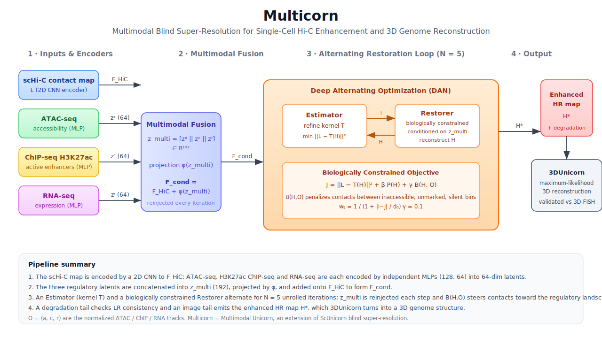

# Unicorn: Enhancing Single-Cell Hi-C Data with Blind Super-Resolution for 3D Genome Structure Reconstruction

Unicorn integrates three subsystems for high-resolution chromatin modeling and structural inference from sparse, noisy Hi-C data:

- **ScUnicorn** — unimodal blind super-resolution enhancement of single-cell Hi-C (scHi-C) data.
- **Multicorn** — multimodal extension of ScUnicorn that grounds enhancement in the regulatory state of the genome using ATAC-seq, ChIP-seq H3K27ac, and RNA-seq.
- **3DUnicorn** — 3D genome structure reconstruction from the enhanced contact maps.

---

## Multicorn: Multimodal Enhancement

**Multicorn** (**Multi**modal Uni**corn**) is an improvement over Unicorn. Existing scHi-C enhancers, including blind super-resolution frameworks, treat the contact map as a self-contained image and therefore restore it as a pattern of pixels, without regard for the underlying regulatory state of the genome. As a result, mathematically plausible contacts can still be biologically implausible.

Multicorn integrates three orthogonal functional-genomics modalities, **ATAC-seq** (chromatin accessibility), **ChIP-seq H3K27ac** (active enhancers), and **RNA-seq** (transcriptional output), as biological priors that guide reconstruction. A multimodal fusion layer encodes each 1D omics signal into a latent representation that conditions the deep alternating optimization loop, and a biologically constrained loss penalizes contacts that contradict the local regulatory landscape. Downstream 3D reconstructions from Multicorn-enhanced maps show improved agreement with orthogonal 3D-FISH measurements.

See [`Multicorn/`](Multicorn/) for the implementation, architecture diagram, and full documentation.



---

This work will be presented at the ISMB/ECCB 2025 conference (July 20-24, 2025) in an oral talk in Liverpool, UK.

---

[OluwadareLab, University of Colorado, Colorado Springs](https://uccs-bioinformatics.com/)

---


---

## Repository Structure

```
Unicorn-Hi-C/
├── ScUnicorn/     # Unimodal blind super-resolution of scHi-C contact maps
├── Multicorn/     # Multimodal (ATAC + ChIP + RNA) enhancement, improvement over Unicorn
└── 3DUnicorn/     # 3D genome structure reconstruction from enhanced maps
```

The end-to-end pipeline is: raw scHi-C `→` ScUnicorn or Multicorn enhancement `→` 3DUnicorn 3D reconstruction.

---
## Documentation

Please see the [wiki](https://github.com/OluwadareLab/Unicorn/wiki) for an extensive documentation.


---
### Citation
Mohan Kumar B Chandrashekar, Rohit Menon, Samuel Olowofila, Oluwatosin Oluwadare, Unicorn: enhancing single-cell Hi-C data with blind super-resolution for 3D genome structure reconstruction, Bioinformatics, Volume 41, Issue Supplement_1, July 2025, Pages i475–i483, https://doi.org/10.1093/bioinformatics/btaf177

---

## 👨‍💻 Contributors
- M. B. Chandrashekar
- R. Menon
- S. Olowofila
- O. Oluwadare

---

## 📜 License
This project is licensed under the MIT License. See the LICENSE file for details.


<!- docker run --rm -it --name scunicorn -v ${PWD}:${PWD} oluwadarelab/unicorn->